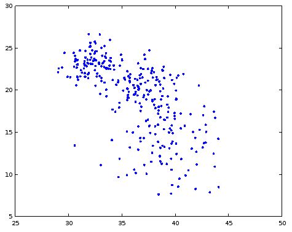

# Поиск кластеров алгоритмом k-средних

## Условие задачи

Алгоритм k-средних получает на вход множество точек, число `k` и разбивает точки на `k` множеств так, что точки одного множества визуально образовывали группу (кластер). Например, на рисунке ниже точки образуют три кластера:


Формально, вам необходимо создать функцю `k_means`, которая получает на вход матрицу точек (точки расположены по строкам), число `k` и возвращает матрицу-столбец с номерами кластеров от 1 до `k`. Высота матрицы с результатом равна высоте исходной матрицы.

Для того, чтобы вы могли тренироваться в кластеризации, я написал вам генератор наборов точек, образующих кластеры:

        ```
        # функция создает k кластеров
        function xy = k_means_generate_clusters(k)
          xy = [];
          for i = 1 : k
            xy = [xy; generate_cluster(100)];
          endfor
        endfunction

        # фукнция создает один кластер со случайным центром и размером
        function xy = generate_cluster(n)
          m = rand(1, 2) * 50; # случайный центр
          s = rand * 3 + 1; # случайный размер
          xy = randn(n, 2) .* s + m;
        endfunction
        ```
Функция `k_means_generate_clusters(3)` генерирует кластеры типа таких, как изображены на рисунке выше, но иногда кластеры могут случайно пересечься, и результат будет примерно таким:



Это нормальная ситуация, в ней тоже интересно запускать алгоритм кластеризации.

## Последовательность выполнения задачи

### Шаг 1. Выбор случайных центров кластеров

Функция `centers = select_k_clusters(xy, k)` получает на вход матрицу точек и число `k`, возвращает матрицу размера \\(2\\times k\\), состоящую из `k` случайных точек. Т.е. вам нужно выбрать `k` случайных индексов строк, выбрать эти строки из `xy` и составить из них матрицу `centers`. Используйте функцию `randi`.

Эти `k` точек — это первоначальная попытка угадать центры кластеров. Конечно, центры угадаются плохо, но дальше мы будем улучшать наши догадки, пока центры не станут правильными.

### Шаг 2. Распределение точек по кластерам.

Функция `c = distribute_points(xy, centers, k)` должна по матрице точек и координатам центров распределить каждую точку к тому центру, к которому она ближе. Если точка имеет координаты \\((x, y))\\), то расстояние до центра \\((c_x, c_y)\\) равно \\(\\sqrt{(x-c_x)^2 + (y-c_y^2)}\\). При вычислении минимума корень можно не брать. Матрица `c` должна быть матрицей столбцом такой же высоты как и `xy`, в ней находятся номер того центра из матрицы `centers`, к которому точка ближе всего. Т.е. матрица `c` состоит из натуральных чисел от 1 до `k`.
