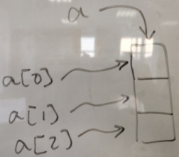
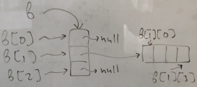

# Значение null

Переменная любого объектного типа
(т.е. не одного из 8 базовых)
может иметь значение `null`,
которое означает "отсутсвие
значения" в переменной. Например,
```
String s = null; //нет строки
String s1 = ""; //пустая строка
int[] a = null; //нет массива
```

Единственная операция, которую
можно совершать с `null` это
сравнение с `null`:

```
if (s == null)
```

Всё другое ведет к исключениям:
```
s.equals("abc")
s.length()
```
Вы увидите сообщение о
`NullPointerException`.

Еще null возникают при создании
массивов:
```
String[] s = new String[10];
```
Если создается массив элементов
объектного типа, то все элементы
изначально установлены в `null`:
```
System.out.println(s[0]); //null
```

Замечание. У значения
`null` нельзя вызывать методы,
но такое значение можно
передавать в качестве аргументов
методов:

```
System.out.println(null);
"abc".equals(null); // false
```

Здесь ошибок не возникает.
Т.е. лучше пишите
`"abc".equals(s)`
вместо 
`s.equals("abc")`.
А еще лучше:
`Objects.equals(s, "abc")`.

# Двумерные массивы

В Java можно создавать массивы,
которые в качестве элементов
содержат другие массивы:

(если `A` - тип, то `A[]` -
массив элементов этого типа)

```
//массив целых
int[] a = new int[10];
//массив из массивов целых
int[][] b = new int[2][3];
```
Т.е. переменная `b` - это массив, который в качестве элементов содержит массивы чисел. Можно вводить `int[][][][]` и т.д.

Напоминание о том, как массив хранится в памяти:



## Создание многомерных массивов
1. Можно указать сразу количество
элементов в каждой размерности:
    ```
    int[][] c = new int[3][4]
    ```
    Это означает, что создан
    массив
    `c`, который содержит 3
    элемента, это `c[0]`, `c[1]`, `c[2]`,
    и каждый из них содержит массив размера 4:
    
    
    
    Можно указать только количество
    элементов по первой размерности:
    
    ```
    int[][] b = new int[3][];
    ```
    Получится массив из 3 элементов `b[0]`, `b[1]` и `b[2]`, каждый из них имеет тип `int[]`, но хранится там null. Можно добавить
    ссылку на массив:
    
    ```
    int[][] b = new int[3][];
    b[1] = new int[4];
    ```
    
    
    
    Поэтому в Java можно делать непрямоугольные массивы:
    
    ```
    int[][] b = new int[3][];
    b[0] = new int[5];
    b[1] = new int[4];
    b[2] = new int[6];
    ```
    Здесь создан массив из трех
    подмассивов (строк),
    их длины 5, 4, 6.
1. Можно сразу указать элементы
многомерного массива:
```
int[][] a = new int[][]{{1, 2, 3}, {4, 5}};
```    
Теперь `a[0]` это массив {1, 2, 3}. `a[1]`
это массив {4, 5}. Т.е., например,
`a[1][0]` это 4.

1. Как и в одномерных массивах, если
предыдущий способ создания массива используется
в инициализаторе переменной, можно начало
не писать:
```
int[][] a = {{1, 2, 3}, {4, 5}};
```

## Примеры перебора элементов массива
Пусть дан `int[][] a`
```
//перебираем строки
for (int i = 0; i < a.length; i++) {
    //перебрать элементы строки
    for (int j = 0; j < a[i].length; j++)
        System.out.print(a[i][j]);
    System.out.println();
}
```

Аналогично, но с циклом for each:

Напоминание:

```
double[] b = {10, 20, 30};
//вместо
for (int i = 0; i < b.length; i++)
    System.out.println(b[i]);
//есть for-each. Слева от : переменная,
//справа - массив для перебора
for (double x : b)
    System.out.println(x);
```

Теперь используем for each для перебора
двумерного массива:
```
for (int[] line : a) { //перебор строк
    for (int x : line)
        System.out.println(x);
    System.out.println();
}
```

# Представление типов данных в памяти, передача аргументов в функции

Все объектные типы хранятся в переменных в виде ссылок. (аналогично
python).
