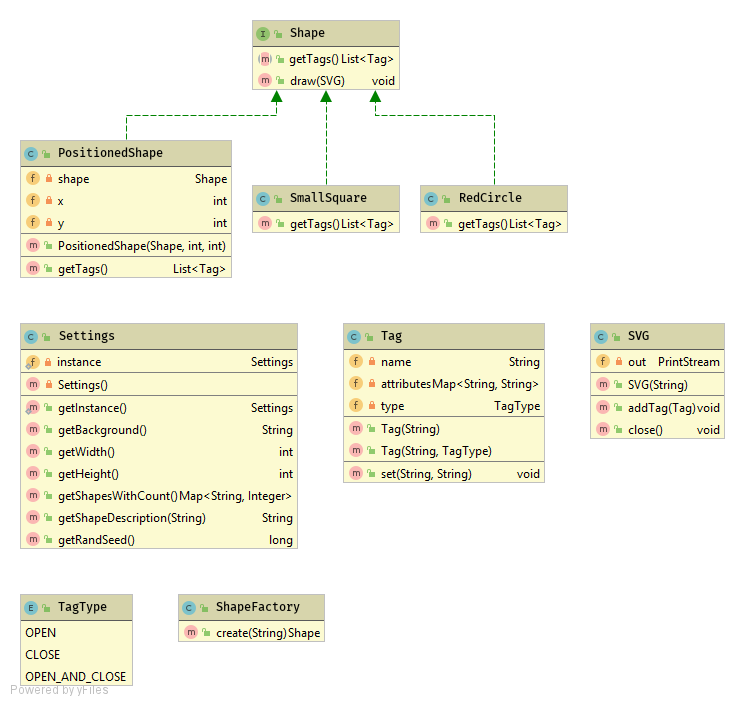

# Рисование SVG

Пример SVG изображения:
```svg
<svg xmlns="http://www.w3.org/2000/svg" width="200" height="200">
    <rect x="10" y="10" height="100" width="100" style="stroke:#ff0000; fill: #0000ff"/>
</svg>
```

[Справочник по элементам и атрибутам SVG](https://developer.mozilla.org/ru/docs/Web/SVG)

## Диаграмма классов
Это те классы, которые должны получиться в окончательной версии программы:


## Условие задачи

1. Вспомогательные классы для рисования
SVG
    1. Класс SVG, содержит открытый
    PrintStream для печати SVG:
    ```
    SVG svg = new SVG("a.svg", 300, 300);
    svg.addTags(rect1);
    svg.addTags(rect2);
    svg.close();
    ```
    В конце обязательно будет вызвано закрытие, чтобы закрыть PrintStream
    2. Класс Tag - это описание одного тега.
    ```
    Tag rect1 = new Tag("rect");
    rect1.set("x", "200");
    rect1.set("y", "200");
    rect1.set("width", "10");
    rect1.set("height", "20");
    rect1.set("style", "stroke:#ff0000; fill: #0000ff");
    ```
3. Когда сделаете классы Tag и SVG, проверьте, что вы можете создавть картинки с их помощью.
1. Измените код так, чтобы не требовалось вручную вызывать `close()` в классе SVG. Для этого класс SVG должен реализовать интерфейс
AutoClosable, и после этого класс можно будет использовать в конструкции try-with-resource:
```
try (SVG svg = new SVG("a.svg", 300, 300)) {
    ...
```
4. Класс Shape. Фигура. Изображение будет рисоваться из большого числа фигур. Какие имеено фигуры будут использоваться для рисования,
будет задаваться в настройках. Этот класс должен иметь конструктор без агрументов. И он имеет метод getTags(), который возвращает
список тегов `List<Tag>` для рисования этой фигуры.
